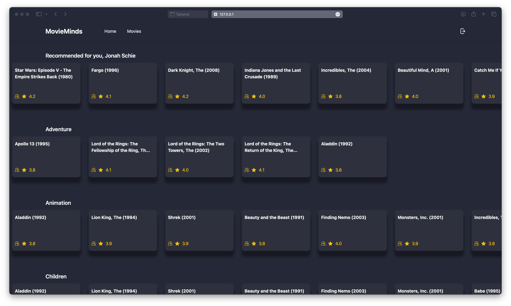

# Movie recommender

This tool was developed as part of the seminar "AI and the Web" at Osnabrück University. We used a simple rule based recommendation algorithm that is based on other users likes who have similar viewing preferences as the current user. We utilize a SQLite based database, which has been filled with data provided by IMDB.

## Front-End Design Using Tailwind CSS and Flask

The front-end of our movie recommendation platform is designed using Tailwind CSS, a utility-first CSS framework, in conjunction with Flask, a lightweight web application framework in Python. This combination offers a sleek, responsive, and user-friendly interface. Key features of our front-end include account creation, password reset via email, and seamless integration with Flask's backend functionalities.

  

### Account Creation

- **Functionality**: Allows new users to create an account.
- **Design**: Utilizes Tailwind CSS for a clean and intuitive form layout.
- **Process**:
  - Form fields include username, password, email, first and last name.
  - Client-side validation for immediate feedback on input errors.
  - Flask handles form submission and user data storage securely.

### Password Reset via Email

- **Functionality**: Enables users to reset their password via email.
- **Implementation**:
  - Users can request a password reset from the login page.
  - The system sends a reset link to the user's registered email using Flask-Mail.
  - The reset page, styled with Tailwind CSS, allows users to enter a new password.

### Rating movies and looking at movie history
- **Functionality**: Users can rate new movies, get recommendations and look their previous movies
- **Implementation**:
  - Get specific and general recommendation on the homepage.
  - Rate a movie by clicking the title and then handing out 1 to 5 stars.
  - Look at your watch history by clicking the movies button.

### Flask Integration

- **Backend Connection**: Flask serves as the backend, handling HTTP requests and responses.
- **Database Interaction**: Flask integrates with the database for user authentication, account creation, and password management.
- **Session Management**: Utilizes Flask's session capabilities for maintaining user state across different pages.

(<a href="#top">back to top</a>)

## Database Schema Overview: Concise Field Listings

### User Table (`users`)
- Fields: `id`, `is_active`, `username`, `password`, `email_confirmed_at`, `first_name`, `last_name`, `reset_token`, `reset_token_expiration`
- Relationships: `ratings`

### Movie Table (`movies`)
- Fields: `id`, `title`
- Relationships: `genres`, `tags`, `links`, `ratings`

### MovieGenre Table (`movie_genres`)
- Fields: `id`, `movie_id`, `genre`

### Tags Table (`tags`)
- Fields: `id`, `tag`, `movie_id`, `user_id`, `timestamp`

### Links Table (`links`)
- Fields: `id`, `imdb_id`, `tmdb_id`, `movie_id`

### Ratings Table (`ratings`)
- Fields: `id`, `rating`, `movie_id`, `user_id`, `timestamp`

This format provides a quick reference to the structure and fields of each table in the database schema for a movie recommendation system.

(<a href="#top">back to top</a>)

## Database functions
Furthermore, the database provides the following functions, which are critical to the later described recommender algorithm:

### `get_user_ratings(user_id)`

- **Purpose**: Fetches and returns a list of movies rated by a specific user, including movie title, user rating, movie ID, and rating timestamp.
- **Parameters**: `user_id` (integer) - Unique identifier of the user.
- **Returns**: JSON response containing a list of movies with details or an error message if the movie is not found.
- **Details**: Retrieves user's ratings from the `Ratings` table. If the related movie is missing, it returns an error.

### `get_matched_movies(user_id, number_of_movies, result_limit=30)`

- **Purpose**: Finds and returns movies watched by users with similar viewing history to the specified user.
- **Parameters**: 
  - `user_id` (integer) - Unique identifier of the user.
  - `number_of_movies` (integer) - Number of recently watched movies to consider.
  - `result_limit` (integer, optional) - Maximum number of results to return.
- **Returns**: JSON response containing a list of users and their unwatched movies that match the specified user's preferences.
- **Details**: Matches users based on overlapping movie ratings and filters out movies already watched by the specified user.

(<a href="#top">back to top</a>)

## Movie Recommendation Engine Algorithm Summary

The movie recommendation engine employs a combination of mathematical and algorithmic methods to analyze user preferences and recommend movies. Here's an overview of the core algorithm:

1. **Extract Latest Movies**:
 - Sort movies based on Unix epoch time timestamps.
 - Select the latest `n` movies, where `n` is either specified or defaults to the length of the movie list.

2. **Cosine Similarity Calculation**:

Calculate the cosine similarity for each pair of user movie lists using the formula:

$$
\text{Cosine Similarity} = \frac{\Sigma(A_i \times B_i)}{\sqrt{\Sigma(A_i^2)} \times \sqrt{\Sigma(B_i^2)}}
$$

   - $\Sigma(A_i \times B_i)$ represents the sum of the product of ratings $A_i$ and $B_i$ for the `i`-th movie, considering only movies common to both lists.
   - $\sqrt{\Sigma(A_i^2)}$ represents the square root of the sum of the squares of ratings in user A's list.
   - $\sqrt{\Sigma(B_i^2)}$ represents the square root of the sum of the squares of ratings in user B's list.
   - The calculation considers only the movies that are common to both lists, with `n` representing the count of these common movies.

3. **Finding Most Similar Users**:
 - Rank users based on their similarity scores, calculated in the previous step.
 - Select users with the highest similarity scores.

4. **Top-Rated Movies Selection**:
 - Aggregate movie ratings from similar users.
 - Calculate the average rating for each movie.
 - Sort movies by these average ratings and select the top `N` movies, excluding any specified movies.

5. **Similar Movies for Target User**:
 - For a target user, find overlapping users (those with similar movie interests) and calculate their similarity.
 - Recommend top movies from these similar users, excluding movies already rated by the target user.

This algorithm effectively integrates sorting, averaging, and similarity calculation (via cosine similarity) to deliver personalized movie recommendations. Its efficiency in handling large datasets and the use of cosine similarity for meaningful comparison of user preferences based on movie ratings are key aspects of its design.

(<a href="#top">back to top</a>)

## 📝 Authors
[Cornelius Wolff](mailto:cowolff@uos.de) 
[Christine Arnoldt](mailto:carnoldt@uni-osnabrueck.de) 
[Jonah Schlie](mailto:jschlie@uni-osnabrueck.de) 

(<a href="#top">back to top</a>)

